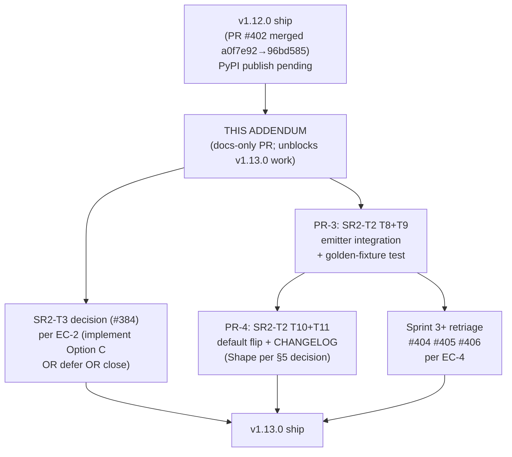

# ADR-0006 Sprint 2 Programme Addendum

**Status:** Accepted — programme complete (v1.12.0–v1.14.0); coordination record, candidate for archive
**Date:** 2026-05-12
**Authors:** technical-architect (advisory)
**Decision owner:** holistic-orchestrator
**Parent:** [ADR-0006 Writer/Reader Symmetry](./adr-0006-writer-reader-symmetry.md)
**Cross-references:**
- [ADR-0006 SR1-T1: Unified Grammar Core](./adr-0006-sr1-t1-grammar-core-design.md) (Sprint 1, complete in v1.12.0)
- [ADR-0006 SR2-T2: AST Source-Span Coverage Audit (Strategy A)](./adr-0006-sr2-t2-ast-span-coverage-audit.md) (Sprint 2, T1–T7 merged; T8–T11 pending)
- [ADR-0006 G3: META Audit-Marker Admission Policy](./adr-0006-g3-meta-audit-markers.md) (SR2-T3 sub-spec)
- v1.12.0 CHANGELOG entries (`CHANGELOG.md` lines 8–95) — "NOT YET in this release (coming in v1.13.0)" commitments
- Tracking issues: #376, #377, #369, #384, #404, #405, #406, #411

---

## 1. Purpose & authority

This addendum is the **authoritative Sprint 2 coordination point** for ADR-0006. Both the HO session driving Strategy A (SR2-T2 T8/T9/T10/T11 — PR-3 and PR-4 in the audit's stack) and any HO session driving SR2-T3 (#384) MUST read this addendum before opening new work. It supersedes any prior ordering recommendations issued from individual HO sessions.

It does **not** re-design T8 (the emitter contract design lives in `adr-0006-sr2-t2-ast-span-coverage-audit.md` §5, Option A) nor T3 (the admission policy design lives in `adr-0006-g3-meta-audit-markers.md` §Recommendation, Option C). Its job is to (A) state the Sprint 2 exit criteria explicitly; (B) render the T2⇌T3 coordination verdict; (C) recommend the T1b SemVer rollout shape; (D) publish the PR-list dependency graph.

This addendum is **docs-only**. No `src/` changes. Any code drift surfaced during the analysis is filed as a separate follow-up; none is folded into this PR.

---

## 2. Where Sprint 2 stands today (2026-05-12)

- **v1.12.0 has shipped** (PR #402 merged at `96bd585`; release prep complete; PyPI publish pending). The CHANGELOG explicitly defers three items to v1.13.0 "after ADR-0006 Sprint 2 exit criteria are written" — this addendum closes that precondition.
- **SR2-T1a — `format_style` toggle API surface** — DELIVERED in PR #378 (CHANGELOG line 174–176). Public toggle exists; default is `None` (today's full canonical re-emit behaviour).
- **SR2-T1b — `format_style="preserve"` as default** — DEFERRED to v1.13.0. Requires Strategy A engine landed first (CHANGELOG line 23–24).
- **SR2-T2 — AST span coverage + dirty-bit model (Strategy A engine for #377)** — IN FLIGHT:
  - PR-1 (T1+T2+T3): span infrastructure — MERGED via #412.
  - PR-2 (T4+T5+T6+T7): dirty-bit + `_apply_changes` integration — MERGED via #414.
  - Audit doc revisions: #409, #413 MERGED.
  - **Remaining:** PR-3 (T8+T9 — emitter integration + golden-fixture test); PR-4 (T10+T11 — default flip + CHANGELOG/migration docs).
- **SR2-T3 — META audit-marker admission policy (#384)** — SCOPED via sub-spec `adr-0006-g3-meta-audit-markers.md` (Option C: bounded-prefix admission through the existing `W_META_*` warning channel). Implementation NOT STARTED.
- **Sprint 3+ tracking issues** — `#404` (META `was_quoted` population), `#405` (trivia population), `#406` (lexer W-code for triple-quote collapse) — all explicitly tagged `[Sprint 3+ — DO NOT START]`, gate-blocked on this addendum.
- **Recent precedent of note (#408 / GH-386)**: introduced `SUPPRESSIBLE_NORMALIZATION_CODES: frozenset[str] = frozenset({"W002"})` in `src/octave_mcp/core/repair_log.py:18`. A closed admission set keyed on warning code; **NO per-node flag state**. This is the worked example for the T2⇌T3 lens below.
- **Known v1.13.0 defects (#411)**: four `octave_write` changes-mode defects (APPEND-Python-repr, expanded over-lift, MERGE inline-array gap, validator false-green). Tagged for v1.13.0 alongside Strategy A; not exit-criterion blockers for Sprint 2 *as a sprint* — but are exit-criterion items for the v1.13.0 release.

---

## 3. Sprint 2 exit criteria

The following MUST hold before any v1.13.0 work begins. Each line is testable.

### EC-1 — Strategy A engine merged and gated — **SATISFIED (2026-05-13)**

**Resolution:** PR #418 merged (`fe7734f`); EC-1a, EC-1b, EC-1c all verified by the PR-3 acceptance suite. Emitter contract is frozen for v1.13.0 per §4.5 — Sprint 3+ retriage (EC-4) opens.

#### Original EC-1 enumeration (preserved for audit trail)

- **EC-1a** — SR2-T2 PR-3 (T8+T9) merged on `main`. `emit()` in `src/octave_mcp/core/emitter.py` honours `FormatOptions.baseline_bytes` + `FormatOptions.enable_preserve`; clean nodes (`not dirty and not repaired` with valid span) slice from baseline; dirty/repaired nodes re-emit through the canonical path. **Verifiable by:** the golden-fixture regression test landed in T9 (single META.STATUS change on a 100–150 KB document → diff footprint ≤ 0.5% of file size; non-changed mixed-annotation regions byte-identical to baseline).
- **EC-1b** — The Strategy-C parse-equality short-circuit at `src/octave_mcp/mcp/write.py` (currently around L1081–L1090 per audit §5) is **deleted**, subsumed by Strategy A. **Verifiable by:** grep gate — no `parse(emit(...)) == parse(...)` short-circuit remains.
- **EC-1c** — HARD_SYMMETRY suite (currently 3108 passed / 11 skipped / 1 xfailed per PROJECT-CONTEXT.oct.md L41) remains green; T9 adds at minimum one fixture-class diff-footprint assertion.

### EC-2 — T3 admission policy decided (#384) — **SATISFIED (2026-05-13)**

**Resolution:** State 1 (Option C implemented and merged via PR #419 — `cad08e1`).

**Evidence (verified by system-steward 2026-05-13):**

- Core implementing commit: `8db1631 feat(validator): admit META audit markers via W_META_AUDIT (GH-384)`.
- Merge commit: `cad08e1 Merge pull request #419 from elevanaltd/feat/gh384-sr2-t3-meta-audit-admission`.
- Constant at `src/octave_mcp/core/validator.py:75-80`:

  ```python
  META_AUDIT_ADMIT_PATTERNS: tuple[str, ...] = (
      "NON_CANONICAL_",
      "DEGRADED_",
      "NORMALIZED_",
      "ROUNDTRIP_",
  )
  ```

- Discriminant helper at `src/octave_mcp/core/validator.py:83-93` (`_matches_audit_pattern`) centralises the admit/warn match per the GH-386 `is_destructive_normalization_repair` precedent.
- Admit path at `src/octave_mcp/core/validator.py:376-377` skips E007 for matching keys.
- Warning emission at `src/octave_mcp/core/validator.py:436-450` (`code="W_META_AUDIT"`) runs unconditionally on a successful validation pass.
- Vocabulary capsule updated at `src/octave_mcp/resources/specs/vocabularies/core/META.oct.md` §4 (AUDIT_MARKERS); registry bumped to META v1.1.0 in cubic P2 follow-up `f6e8929`.
- Test suite: `tests/unit/test_meta_audit_admission.py` (424 LOC, GREEN at `cad08e1`); `tests/fixtures/symmetry/meta_audit_markers.oct.md` adds an admission marker to the HARD_SYMMETRY corpus; `tests/unit/test_writer_reader_symmetry.py` extended (+35 LOC).
- §4.3 evidence E1-E5 verified empirically: no `core/grammar/cst.py` change; no new per-node AST flag-state introduced (cst.py was not touched by PR #419 — confirmed via `git show cad08e1 --stat`). The §4.6 escalation tripwire was NOT triggered during implementation.

**EC-2b status:** Per state-1 resolution, v1.13.0 CHANGELOG will document the admission codes ship in v1.13.0 (alongside Strategy A); ambiguity is closed. PR-4 (T10+T11) authoring is the canonical surface for the CHANGELOG entry.

#### Original EC-2 enumeration (preserved for audit trail)

The criteria as written before resolution. Retained verbatim for historical fidelity.

- **EC-2a** — One of three states is on record before v1.13.0 ships:
  1. T3 (Option C from `adr-0006-g3-meta-audit-markers.md`) implemented and merged: validator emits `W_META_AUDIT` for keys matching `META_AUDIT_ADMIT_PATTERNS = ("NON_CANONICAL_", "DEGRADED_", "NORMALIZED_", "ROUNDTRIP_")`; STRICT-mode admits without E007.
  2. T3 explicitly **deferred** to v1.14.0 with a documented `[Sprint 3+ — DO NOT START]` label on #384 and a CHANGELOG note clarifying that no admission codes ship in v1.13.0.
  3. T3 **closed as won't-do** with a rationale documented in the issue and `--raw=true` semantics adjusted accordingly in a separate ADR.
- **EC-2b** — Whichever state holds, the v1.13.0 CHANGELOG MUST state it in plain English. The CHANGELOG is the contract surface; admission policy ambiguity in the CHANGELOG is itself a I5 (SCHEMA_SOVEREIGNTY) defect because callers cannot tell whether `META.NON_CANONICAL_DEGRADED::true` will validate.

### EC-3 — T1b default flip decided and rolled out
- **EC-3a** — A SemVer scope decision is on record (see §5 for the recommendation): v1.13.0 minor with deprecation window OR v2.0.0 major. The decision is **DUAL_KEY** (critical-engineer + principal-engineer + requirements-steward + HUMAN per `.hestai-sys/library/skills/operating-discipline/SKILL.md` §3).
- **EC-3b** — SR2-T2 PR-4 (T10+T11) merged with the decided rollout shape. `_emit_with_format_style` default at `mcp/write.py:1051` flipped to `"preserve"` (or staged as recommended). CHANGELOG.md + docs/api.md + docs/usage.md updated.
- **EC-3c** — The downstream test migration burden (see §5.3 estimate) is reflected in the PR-4 diff; no test asserting old default semantics is silently broken — each is either migrated to assert the new default or annotated with a deprecation-window xfail.

### EC-4 — Sprint 3+ issues re-evaluated against the frozen emitter contract
- **EC-4a** — Once PR-3 (T8+T9) is merged, the emitter contract is **frozen for v1.13.0**. The three Sprint 3+ issues #404, #405, #406 MUST be re-triaged against the frozen contract within 7 calendar days of PR-3 merge. Each issue is either:
  1. **Ungated** — `[Sprint 3+ — DO NOT START]` prefix removed, milestone reassigned to v1.13.x or v1.14.0 with named dependencies updated.
  2. **Still gated** — the prefix retained, but the issue body updated with "*Still gated because: <specific reason referencing frozen emitter contract>*", referencing this addendum by URL.
- **EC-4b** — #411 (the four `octave_write` defects) is re-evaluated against PR-3 / PR-4 once they merge: defects 1, 2, 3 may be subsumed by Strategy A; defect 4 (validator false-green on writer output) is a separate lexer/validator surface and remains v1.13.0-tracked regardless.

### EC-5 — Known-issues consistency clause
- **EC-5a** — `CHANGELOG.md` v1.12.0 Known Issues section (lines 26–67) remains the canonical pre-Strategy-A workaround surface. Once Strategy A lands and defects are resolved, the v1.13.0 CHANGELOG MUST cross-reference each #411 defect by number and state explicitly which are fixed vs. still open vs. moved.

### EC-6 — State documents updated
- **EC-6a** — `.hestai/state/context/PROJECT-CONTEXT.oct.md` (currently shows NEXT_ACTIONS referencing Sprint 1 SR1_T2/T3/T4) is updated to reflect Sprint 2 frame via `mcp__octave__octave_write` (HONORING OCTAVE_WRITE_GATE; NEVER `Write`/`Edit`). This is a **follow-up to this addendum**, not part of this docs-only PR.
- **EC-6b** — `.hestai/state/context/current-state.oct.md` (currently dated 2026-05-09, branch `octave-format-optimization`, Sprint 1 kickoff) similarly updated via `octave_write`.

---

## 4. The T2 ⇌ T3 coordination gate

### 4.1 The binary question

> Could SR2-T3's NON_CANONICAL_DEGRADED admission policy introduce **per-node flag-state** (analogous to `node.repaired:bool` from PR-2 / #414) that signals "this content is degraded canonical — slice from baseline would re-introduce the degraded form on a parse; therefore force re-emit even when clean"?

If **YES** → **GATE**. T3 must land (or at least its flag-state contract must be designed) before T8 freezes the slice-vs-re-emit decision logic.

If **NO** (T3 only affects the validator's RepairLog/warning channel, not per-node AST state) → **GO**. T8 can proceed in parallel with T3 in any order.

### 4.2 Verdict: **GO**

**T3's design (Option C in `adr-0006-g3-meta-audit-markers.md`) introduces ZERO per-node AST flag-state.** T8 can proceed independent of T3.

### 4.3 Evidence

**E1 — T3's surface lives entirely in the validator warning channel.** Per `adr-0006-g3-meta-audit-markers.md` Recommendation (Option C, §Acceptance Criteria item 1):

> New constant `META_AUDIT_ADMIT_PATTERNS = ("NON_CANONICAL_", "DEGRADED_", "NORMALIZED_", "ROUNDTRIP_")` … `_validate_meta` (L163) extended: before the L180 strict-mode E007 path, keys matching `META_AUDIT_ADMIT_PATTERNS` are skipped from E007. New `_check_meta_warnings` branch (or sibling method) emits `W_META_AUDIT` (informational) for any META key matching the patterns…

The acceptance criteria touch `src/octave_mcp/core/validator.py` (admit path + warning emission) and `src/octave_mcp/resources/specs/vocabularies/core/META.oct.md` (vocabulary capsule). **No `core/grammar/cst.py` change is proposed.** No new field on `ASTNode`, `Document`, `Assignment`, `Block`, `Section`. No new dirty-state vector.

**E2 — Worked-example precedent (#408 / GH-386).** GH-386 introduced exactly the same shape — a closed admission set keyed on warning code — at `src/octave_mcp/core/repair_log.py:18`:

```python
SUPPRESSIBLE_NORMALIZATION_CODES: frozenset[str] = frozenset({"W002"})
```

This is a RepairLog-channel admission set. It did **not** add per-node state (no `Token.suppressed:bool`, no `RepairEntry.suppressible:bool` flag on the AST side). If the analogous T2⇌T3 question had been asked for GH-386, the verdict would have been a **GO** by the same lens. T3's surface is the same shape, one layer up (validator warning channel instead of repair_log discriminator helper).

**E3 — The slice-vs-re-emit decision logic depends only on `dirty` and `repaired`.** Per `adr-0006-sr2-t2-ast-span-coverage-audit.md` §5 Integration sketch:

> For each child of `doc.sections`: if `child.dirty` or `child.repaired` or `not child.start_byte`: call existing `emit_assignment/emit_block/emit_section`. Else: `lines.append(baseline_bytes[child.start_byte:child.end_byte].decode())`.

The two flags consulted are already on the dataclass post-#414 (`src/octave_mcp/core/grammar/cst.py:200-201`):

```python
dirty: bool = False
repaired: bool = False
```

Plus body-dirty and meta_dirty per the post-CDV revisions (cst.py:244, 263, 300):

```python
body_dirty: bool = False           # Block
body_dirty: bool = False           # Section
meta_dirty: dict[str, bool] = field(default_factory=dict)  # Document
```

T3's Option C does not propose adding `node.degraded:bool` or `node.non_canonical:bool` to this set. The audit-marker information lives in `doc.meta["NON_CANONICAL_DEGRADED"]` itself (a normal META key with `bool` value) and in the validator warning channel as `W_META_AUDIT` — neither is a slice-vs-re-emit decision input.

**E4 — `--raw=true` ingest writes META keys; subsequent edits flow through the existing dirty-bit machinery.** SR2-T3 (per the parent `adr-0006-writer-reader-symmetry.md` line 92) stamps `META.NON_CANONICAL_DEGRADED::true` and `META.DEGRADED_REGIONS::[<offsets>]` during raw ingest. When a downstream caller edits the doc, the META-key edit routes through `_apply_changes` and `Document.meta_dirty["NON_CANONICAL_DEGRADED"] = True` is set by the existing #414 machinery. The slice-vs-re-emit emitter loop (T8) then re-emits that META key from canonical and slices everything else from baseline — exactly as for any other META edit. T3 adds no new decision point in the loop.

**E5 — The I1 SYNTACTIC_FIDELITY concern that motivated the question is not triggered by T3.** The North Star defines I1 as *"normalization alters syntax never semantics; canon must be idempotent and bijective on semantic space"* (`.hestai/north-star/000-OCTAVE-MCP-NORTH-STAR-SUMMARY.oct.md:22-26`). T3 admission does NOT mutate AST values during validation — it only changes what error/warning the validator emits. The audit-marker META values themselves are emitted by the writer (SR2-T3 owns that), and the writer's emission goes through the canonical META path (`emitter.py:emit_meta`). There is no source-bytes-vs-AST-value divergence introduced by T3.

### 4.4 What WOULD have made this a GATE

For completeness — the analysis is not vacuous because the question was sharply specified. T3 would have been a GATE if its design proposed any of:

- A new `ASTNode.degraded_canonical:bool` field set by the parser when admission-marker keys are detected, which would influence the slice path.
- An `Assignment.canonical_form_lost:bool` flag indicating that the source bytes of that assignment no longer represent the AST value (an I1 violation under splice).
- A `Document.degraded_regions: list[tuple[int,int]]` field where the byte ranges named would force re-emit even when the containing AST nodes are clean.

Option (C) proposes none of these. The closest analogue in the cst.py dataclass is `repaired:bool` (cst.py:201), which DOES gate the slice path (`adr-0006-sr2-t2-ast-span-coverage-audit.md` §3 — *"Splicing a repaired node is an I1 violation"*). T3 admission keys are **not** repairs in the parser sense — they are validator-channel signals about META content that is, by design, the canonical form of that META key.

### 4.5 Consequence for sequencing

T8 (emitter integration) can land before, after, or in parallel with T3 implementation. The audit's recommended PR stack (`adr-0006-sr2-t2-ast-span-coverage-audit.md` §8) — PR-3 (T8+T9) then PR-4 (T10+T11) — is unchanged. T3 is sequenced into v1.13.0 or v1.14.0 by EC-2 independent of the emitter freeze.

### 4.6 Escalation tripwire (per task SCOPE GUARD)

If during T3 implementation any of E1–E5 are contradicted — e.g. a reviewer requests that `META.DEGRADED_REGIONS` offsets force re-emit of byte ranges they cover, which would require new per-node state — implementer MUST STOP and surface to HO. That contradiction would mean the T3 design has shifted from Option C and re-opens this verdict.

---

## 5. T1b rollout narrative

### 5.1 The decision space

Three rollout shapes are on the table:

- **Shape A — v1.13.0 minor with implicit flip.** `format_style=None` default changes to `"preserve"` in v1.13.0. The CHANGELOG entry is the only deprecation notice.
- **Shape B — v1.13.0 minor with one-version deprecation window.** v1.13.0 keeps `format_style=None` defaulting to today's full-rewrite behaviour but emits a `DeprecationWarning` indicating the default will change in v1.14.0. v1.14.0 flips the default.
- **Shape C — v2.0.0 major.** The default flip is treated as a breaking change to observable output (which it is: every consumer's CI artefacts change shape on the first edit). Bump major.

### 5.2 SemVer analysis

The MCP **tool surface** (`octave_validate`, `octave_write`, `octave_eject`, `octave_compile_grammar`) and CLI signatures remain identical under Shape A. The observable behaviour of `octave_write` — specifically the byte-shape of its output for a single-key edit — changes substantially:

- v1.12.0 default: full canonical re-emit; diff size proportional to file size.
- v1.13.0 default (Shape A): single-region slice-and-replace; diff size proportional to edit size (≤ 0.5% per EC-1a target).

By the strict SemVer reading (`https://semver.org/spec/v2.0.0.html` §8: *"Major version MUST be incremented if any backwards incompatible changes are introduced to the public API"*), output-shape changes are arguably API-level. By the pragmatic Keep-a-Changelog reading (which OCTAVE-MCP already uses per `CHANGELOG.md` line 4), they can be flagged as "Changed" in a minor release with explicit migration notes.

The decisive question is: **do downstream consumers' tests assert against the byte-shape of `octave_write` output?** If yes → Shape C is warranted. If no → Shape A or B suffices.

### 5.3 Test migration burden — initial estimate (NOT a benchmark)

A first-order estimate based on grep patterns over the test suite would clarify the scope, but is **out of scope for this docs-only PR** (would require running tooling against `tests/`). Files most likely to assert byte-shape:

- `tests/integration/test_writer_reader_symmetry.py` (HARD_SYMMETRY suite — by construction asserts byte-stability through round-trips; the suite itself is not affected by the default-flip because it explicitly invokes both paths)
- `tests/unit/test_emitter*.py` family
- `tests/integration/test_mcp_octave_write*.py` family
- Fixture-based regression tests under `docs/research/02_benchmarking_and_generation/octave-write-test-outputs/`

The audit (`adr-0006-sr2-t2-ast-span-coverage-audit.md` §7 R6) flagged this as **Medium probability × Medium impact**:

> Users on v1.12.0 who structured workflows around the existing canonical-rewrite default. … Some downstream pipelines may rely on full-rewrite for normalization side-effects. → Ship T10 in a separate PR with explicit CHANGELOG flag and a feature toggle window. Consider a single-version `format_style: None` → `"preserve"` deprecation period if HO prefers conservative rollout.

### 5.4 Recommendation

**Shape B (v1.13.0 minor with one-version deprecation window).**

Rationale, in priority order:

1. **The flip is observable, not API-breaking.** The signature of `octave_write` is unchanged; output bytes are. SemVer practice within this project (per `CHANGELOG.md` v1.12.0 entry — internal API removals were called out as "Breaking Changes — direct importers of internal API" inside a minor release, line 95+) treats internal-import breakage as minor-eligible with explicit callout. Output-shape changes are a step lighter than internal-import deletion and fit the same model.
2. **A deprecation window costs little but pays in trust.** Adding a `DeprecationWarning` when `format_style=None` is *explicitly* passed (vs. omitted) — and a single CHANGELOG-flagged silent flip on omission — costs ~30 LOC and one extra test file. Caller code that has already moved to passing an explicit `format_style="preserve"` is unaffected. Caller code that omits the parameter sees no error, only the new output shape.
3. **Shape A risks visible regressions in CI artefacts on v1.13.0 install day.** Without a window, any consumer whose CI uploads `octave_write` outputs as artefacts will see massive artefact-shape changes the first time they upgrade. Shape B gives them one minor-release window to lock the parameter explicitly.
4. **Shape C is over-correction.** v2.0.0 is reserved for actual breaking changes to the tool surface (e.g. dropping a tool, renaming a CLI flag). Strategy A is an internal engine swap whose externally visible effect is a *better* default. Inflating to v2.0.0 spends the major-version coupon on something that isn't structurally breaking and degrades the signal value of future v2.0.0 work.

**AUTHORITY_BLOCKING:** This recommendation is advisory. The actual v1.13.0-vs-v1.14.0-vs-v2.0.0 decision is **DUAL_KEY** per `.hestai-sys/library/skills/operating-discipline/SKILL.md` §3:

> DUAL_KEY_GOVERNANCE::"Major scope changes, GO/NO-GO decisions, production deployment → critical-engineer(tactical) + principal-engineer(strategic) + requirements-steward (+ HUMAN)"

HO escalates this addendum's Shape-B recommendation through the DUAL_KEY chain before PR-4 (T10+T11) opens.

### 5.5 CHANGELOG consistency clause — status

The v1.12.0 CHANGELOG (now on `main` at `96bd585`) already commits to **"v1.13.0"** as the vehicle (CHANGELOG.md lines 20–24). The Shape-B recommendation keeps v1.13.0 as the deprecation-warning vehicle and adds v1.14.0 as the default-flip vehicle — this is a softening (v1.13.0 still ships the engine), not a change of vehicle. **No v1.12.1 patch is required** for the CHANGELOG under Shape B.

If HO selects Shape A or Shape C against this recommendation:
- **Shape A** — the v1.12.0 CHANGELOG line 23 already accurately describes Shape A; no amendment required.
- **Shape C** — v1.12.0 CHANGELOG line 23 ("coming in v1.13.0") becomes inaccurate. Because v1.12.0 has already merged to `main`, the CHANGELOG amendment becomes a **v1.12.1 patch PR** (per the task's CHANGELOG CONSISTENCY CLAUSE), filed alongside the PR-4 / v2.0.0 work.

---

## 6. PR-list dependency graph



**Table form (canonical sequencing):**

| Step | Artifact | Gates on | Unblocks |
|---|---|---|---|
| 1 | v1.12.0 ship (merged) | — | this addendum's "supersedes prior recommendations" authority |
| 2 | **THIS ADDENDUM** | v1.12.0 CHANGELOG commitments | PR-3, T3 decision, Sprint 3+ retriage |
| 3 | PR-3 (T8+T9 — Strategy A emitter on) | this addendum (EC-1 criteria) | PR-4, Sprint 3+ retriage (EC-4) |
| 4 | T3 decision recorded (#384) | this addendum (EC-2) | v1.13.0 ship |
| 5 | Sprint 3+ retriage (#404/#405/#406) | PR-3 merge + 7 cal-day window | v1.13.0 ship |
| 6 | PR-4 (T10+T11 — default flip + docs) | PR-3 + §5 DUAL_KEY decision | v1.13.0 ship |
| 7 | v1.13.0 ship | All of EC-1, EC-2, EC-3, EC-4, EC-5 hold | — |

T2 and T3 are **parallel-safe** post-addendum per §4 GO verdict. PR-3 and T3-implementation can proceed in either order or concurrently; only PR-4 strictly depends on §5 DUAL_KEY decision.

---

## 7. Out of scope for this addendum

- T8 emitter contract **design** (lives in `adr-0006-sr2-t2-ast-span-coverage-audit.md` §5).
- T3 admission policy **design** (lives in `adr-0006-g3-meta-audit-markers.md` §Recommendation).
- Test migration enumeration (§5.3 estimate is qualitative; a benchmarked enumeration is a separate task).
- `PROJECT-CONTEXT.oct.md` / `current-state.oct.md` updates (follow-up via `mcp__octave__octave_write` per EC-6).
- #411 defect remediation (sequenced into PR-3 / PR-4 as Strategy A subsumption work).
- Any `src/` change.

---

## 8. Acceptance for this addendum

This addendum is GREEN when:

1. Merged on `main` as a docs-only PR (no `src/` changes).
2. Linked from any new HO-session prompt for SR2-T2 PR-3 / PR-4 work or SR2-T3 implementation.
3. The `.hestai/state/context/PROJECT-CONTEXT.oct.md` follow-up (EC-6a) is filed as a separate task within 7 calendar days of merge.

---

## Citations

- `CHANGELOG.md` lines 1–95 — v1.12.0 entry, NOT YET section, Known Issues, Breaking Changes.
- `docs/adr/adr-0006-writer-reader-symmetry.md` line 92 — SR2-T3 spec for `META.NON_CANONICAL_DEGRADED` / `META.DEGRADED_REGIONS`.
- `docs/adr/adr-0006-sr1-t1-grammar-core-design.md` — Sprint 1 grammar core complete.
- `docs/adr/adr-0006-sr2-t2-ast-span-coverage-audit.md` §3, §4, §5, §7, §8 — Strategy A audit, dirty-bit model, Option-A emitter, R-risk register, PR-stack recommendation.
- `docs/adr/adr-0006-g3-meta-audit-markers.md` Options + Recommendation + Acceptance Criteria — T3 admission policy Option C.
- `src/octave_mcp/core/repair_log.py:18` — `SUPPRESSIBLE_NORMALIZATION_CODES` precedent (#408 / GH-386).
- `src/octave_mcp/core/grammar/cst.py:191-201, 244, 263, 300` — `was_quoted`, `dirty`, `repaired`, `body_dirty`, `meta_dirty` field surface (post-#412 / #414).
- `.hestai/north-star/000-OCTAVE-MCP-NORTH-STAR-SUMMARY.oct.md` lines 22–46 — I1 SYNTACTIC_FIDELITY, I4 TRANSFORM_AUDITABILITY, I5 SCHEMA_SOVEREIGNTY.
- `.hestai-sys/library/skills/operating-discipline/SKILL.md` §3 — DUAL_KEY governance for major scope changes.
- `.hestai-sys/library/patterns/mip-architecture.oct.md` §1 — MIP simplification test for "no new admission codes for v1.13.0" minimal policy.
- Issues: #376, #377, #369, #384, #404, #405, #406, #411 — tracking surface.
- PRs: #402 (v1.12.0), #407 (SR1-T4 no-op), #408 (GH-386 W002 discriminant), #409 + #413 (audit doc), #412 (PR-1 span infra), #414 (PR-2 dirty-bit).
